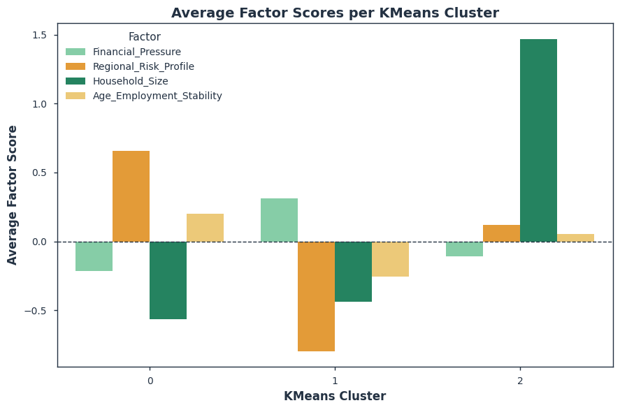

<p align="center" style="font-family:cursive; color:orange; font-size:120%;">
UCD College Dublin
</p>

<h1 align="center">💸 Fair Loan Default Prediction 💸</h1>

<p align="center" style="color:#159364; font-family:cursive; font-size:100%;">
<em>Data & Computational Science — Final Project, UCD</em><br>
</p>

---

<p align="center">
  
</p>

---

<p align="center">
  
  
  
  
  
  

</p>

---


**View notebook outputs here:** https://nbviewer.org/github/ACM40960/Fair-Loan-Default-Prediction/blob/main/notebooks/fair_loan_default_prediction.ipynb

## Business Objective
This project builds a **predictive model** to classify applicants as **defaulters** or **non-defaulters** based on their application data.  
The goal is to **minimize credit risk** for banks while ensuring the decision process remains **fair, unbiased, and transparent**.

The analysis balances **predictive performance** with **responsible AI practices**, including:
- **Fairness auditing** using `fairkit-learn` to detect and mitigate bias.  
- **SHAP explainability** to reveal key drivers of predictions, both globally and per applicant.  

### Key Goals
- **Improve risk assessment** with accurate default prediction.  
- **Ensure fairness** across gender, region, and employment type.  
- **Support compliance** with ethical & regulatory standards.  

### Success Metrics
- **Primary**: Recall (True Positive Rate) for defaulters, Average Precision (PR-AUC).  
- **Secondary**: ROC-AUC, Precision@threshold, F1-score, KS statistic.  
- **Fairness**: Evaluate disparity indices (equal opportunity, demographic parity).  


---

## Getting Started

```bash
git clone https://github.com/<your-username>/<repo-name>.git
cd <repo-name>

python3 -m venv venv
source venv/bin/activate   # Linux/Mac
venv\Scripts\activate      # Windows

pip install -r requirements.txt
# (Optional GPU/RAPIDS)
pip install -r requirements-gpu-optional.txt

#If using Jupter notebook
pip install jupyter
jupyter notebook

#If using Python scripts:
python main.py

#To save the exact env setup (Optional)
pip freeze > requirements.txt

```

## Repository Structure
```
fair-loan-default-prediction/
├─ notebooks/
│ └─ fair_loan_default_prediction.ipynb # Main analysis notebook
│
├─ src/ # Python scripts (modular utilities)
│ ├─ mlflow_logger.py # Logs experiments & metrics to MLflow
│ ├─ optuna_runner.py # Hyperparameter tuning with Optuna
│
├─ data/ (gitignored) # Raw datasets from Kaggle
│ ├─ application_data.csv
│ ├─ previous_application.csv
│ └─ columns_description.csv
│
├─ logs/ (gitignored) # Experiment logs
| ├─ best_model/ # Saved best model artifacts
│ ├─ optuna_credit.db # Optuna studies (SQLite)
│ ├─ optuna_credit_v2.db
| └─ optuna_credit_v3.db
├─ README.md # Project documentation
├─ requirements.txt # Dependencies
├─ requirements-gpu-optional.txt # GPU Dependencies
├─ .gitignore # Ignore data, logs, artifacts
└─ LICENSE # MIT License
```

### Core Libraries

- **Data Handling:** `pandas`, `numpy`  
- **Modeling:** `scikit-learn`, `xgboost`, `imbalanced-learn`, `thundersvm`, (`cuML` for GPU acceleration)  
- **Optimization & Tracking:** `optuna`,`MLflow`  
- **Visualization & Explainability:** `matplotlib`, `seaborn`, `shap`  
- **Fairness Auditing:** `fairkit-learn`

For the complete list of dependencies, see [`requirements.txt`](requirements.txt).  
GPU/RAPIDS users can optionally install [`requirements-gpu-optional.txt`](requirements-gpu-optional.txt).

## Methodology

The project follows a structured pipeline to build, evaluate, and audit fair loan default prediction models:

### Data
- **Source:** Kaggle Home Credit Default dataset  
- **Files used:**  
  - `application_data.csv` (main application features)  
  - `previous_application.csv` (historical loan behavior)  
  - `columns_description.csv` (feature metadata)  
- **Target variable:** `TARGET`  
  - `0` = Loan repaid  (92%)
  - `1` = Default      (8%) #Highly Imbalanced

---

### Preprocessing
- Missing value handling (median for numeric, most frequent for categorical).  
- Feature scaling for numerical variables (StandardScaler).  
- One-hot encoding for categorical features.  
- Feature engineering:  
  - Credit-to-income ratio  
  - Family burden index  
  - Previous loan statistics (count, sum, mean)  

---

### Handling Imbalance
- Severe class imbalance (~8% defaulters).  
- Strategies tested:  
  - **Class weighting** (SVM, RF)  
  - **Undersampling majority class**  
  - **SMOTENC** (synthetic minority oversampling)  

---

### Modeling
Implemented multiple ML algorithms for comparison:  
- SVM (RBF kernel, class weights)  
- Random Forest  
- XGBoost    
- Logistic Regression  
---

### Hyperparameter Tuning
- **Optuna** with 5-fold Stratified Cross-Validation.  
- Objective function: **maximize PR-AUC** (average precision).  
- Search spaces defined per model (trees, depth, learning rate, etc.).  

---

### Experiment Tracking
- **MLflow** used to log:  
  - Parameters  
  - Metrics (ROC-AUC, PR-AUC, Recall, Precision, F1)  
  - Plots (ROC, PR curves)  
  - Artifacts (best model pickle, reports)  

---

### Evaluation
- Primary metrics:  
  - **Recall (True Positive Rate)** for defaulters  
  - **PR-AUC (Average Precision)**  
- Secondary metrics:  
  - ROC-AUC  
  - Precision @ threshold  
  - F1-score  
  - KS statistic  
- Threshold selection: recall at precision floor (business-oriented).  

---

### Explainability
- **SHAP** analysis:  
  - Global importance (summary plot)  
  - Local explanations (individual applicant force plots)  

---

### Fairness Audit
- **FairKit-Learn** used to evaluate fairness across sensitive attributes:  
  - Gender  
  - Age group  
  - Employment type  
- Metrics:  
  - Demographic parity  
  - Equal opportunity (recall parity)  
  - Approval rate disparity  

---

## Results
### Exploratory Data Analysis (EDA)

I performed univariate, bivariate, and multivariate analyses to understand default patterns in the dataset.

<p align="left">
  
</p>

*Tells us which cat. variables are most informative for predicting default status and can help guide feature selection in modeling.*

<p align="left">
  
</p>

*Three distinct borrower clusters emerged, with varying default rates (6–9%).*

<p align="left">
  
</p>

*Factor Analysis on K-means*
*Cluster 2 shows high household size stress, while Cluster 1 exhibits strong regional risk profiles. These latent factors help explain differences in default risk.*

### Model Results 
XGBoost, LogReg, SVM, Random Forest with Optuna hyperparameter tuning, focusing on recall for defaulters and evaluating threshold strategies for business alignment.

#### Winner Model

- **Model:** `<XGBoost>`
- **Operating threshold:** `<0.563>` (selected to meet business precision floor ≥ 24%)

| Model   | ROC-AUC | PR-AUC | Recall@thr | Precision@thr | F1@thr | KS | Threshold | MacroRecall |
|---------|:------:|:------:|:----------:|:-------------:|:-----:|:--:|:---------:|:------:|
| XGboost  |  0.76 | 0.247  |   0.557    |     0.24     | 0.294 |0.387|  0.563    | 0.652|


### SHAP-Based Explainability 
Used SHAP values to interpret model predictions, identifying savings score, loan amounts, and external credit bureau scores as the strongest risk indicators, with demographic stability offering mild protective effects.

| SHAP Summary | SHAP Importance |
|--------------|-----------------|
|  |  |

  

### Fairness Detection
I audited model fairness across groups (gender, family status, etc.), finding disparities in approval rates and recall (TPR), where certain groups (e.g., widows) faced over-approvals but weaker recall.


| Family Status Recall | Family Status Approval |
|--------------|-----------------|
|  |  |


*Approval rates vary across family status, with Widow (87.9%) highest and Single/Not married (69.8%) lowest.*
*TPR is highest for Civil marriage (63.5%) and Single/Not married (63.4%), and lowest for Widow (37.8%), indicating recall disparity.*

### 3-Tier Lending Policy Results

I designed a 3-tier lending strategy (auto-decline, manual review, approve) to balance recall with business precision, concentrating most defaults in the decline tier while keeping approval risk low.

- **3-Tier Lending Policy** designed from model probability scores:  
- **Tier 1:** Approve (low risk), p < t₁
- **Tier 2:** Review / Conditional Loan (medium risk), t₁ ≤ p < t₂
- **Tier 3:** Reject (high risk), p ≥ t₂
- Balances **risk minimization** with **fair lending practices**.


| Tier           | Cases  | Defaults | Share of Pop. | Share of Defaults | Default Rate | Lift vs Baseline |
|----------------|--------|----------|---------------|-------------------|--------------|------------------|
| **Auto-decline** | 13,837 | 3,265    | 15.0%         | 43.8%             | 23.6%        | 2.92×            |
| **Manual review** | 18,450 | 1,962    | 20.0%         | 26.3%             | 10.6%        | 1.32×            |
| **Approve**      | 59,963 | 2,220    | 65.0%         | 29.8%             | 3.7%         | 0.46×            |


<p align="left">
  
</p>


**Conclusion**

* XGBoost with class weighting achieved \~65% recall on defaulters while balancing business thresholds.
* SHAP analysis revealed savings, loan size, and external credit scores as the key drivers of default.
* A 3-tier lending policy was designed to capture most defaults in the decline group while reducing risk in approvals, addressing both performance and fairness.


